# GAPCO - Manual de usuario

## Contenido
1. Información general
2. Usuarios
  * 2.1. Tipos de usuario
    * 2.1.1. Coordinador
    * 2.1.2. Responsable
  * 2.2. Ver listado de usuarios
  * 2.3. Crear usuario
  * 2.4. Editar usuario
  * 2.5. Eliminar usuario
2. Cuenta
  * 2.1. Inicio de sesión
  * 2.2. Cerrar sesión
  * 2.3. Editar mi cuenta y cambiar mi contraseña
  * 2.4. Olvidé mi contraseña
3. Áreas
  * 3.1. Ver listado de áreas
  * 3.2. Ver área
  * 3.3. Crear área nueva
  * 3.4. Editar área
  * 3.5. Eliminar área
4. Recomendaciones
  * 4.1. Ver recomendación
  * 4.2. Crear recomendación
  * 4.3. Editar recomendación
  * 4.4. Eliminar recomendación
5. Metas y acciones
  * 5.1. Crear meta y acción
  * 5.2. Editar meta y acción
  * 5.3. Eliminar meta y acción
6. Evidencias
  * 6.1. Ver evidencia
  * 6.2. Crear evidencia
  * 6.3. Editar evidencia
  * 6.4. Eliminar evidencia
7. Alertas
  * 7.1. Ver alertas
  * 7.2. Crear alerta
  * 7.3. Eliminar alerta
  * 7.4. Ocultar alerta
  * 7.5. Mostrar alerta
8. Notificaciones
  * 8.1. Ver notificaciones
  * 8.2. Eliminar notificaciones
9. Reportes
  * 9.1. Generar reporte

## 1. Información general
GAPCO (Gestión de Acreditación de Programa CONAIC) es una aplicación web cuyo propósito es el manejo de la información requerido que concierne a las distintas áreas de acreditación dentro del programa de Ciencias de la Computación de la Universidad de Sonora.

Trabajar con el sistema es sencillo, sin embargo, se asuma que el usuario está familiarizado con los términos utilizados para la acreditación que proporciona CONAIC.

Este documento pretende presentar la información necesaria para el mmanejo de las caracteristicas y funciones del software GAPCO para asegurar el mayor aprovechamiento de éste.

## 2. Usuarios
#### 2.1. Tipos de usuario
GAPCO cuenta con funciones para la creación y manipulación de áreas, recomendaciones, evidencias, alertas, entre otros elementos, de los cuales varios son parte crucial para la generación de reportes; es por esto que ciertas funcionalidades están restringidas para que solo puedan ser accedidas por un usuario identificado como coordinador; dentro de este documento se aclarará en cada sección que si unicamente el usuario coordinador puede realizar cierta acción. A continuación, se presentan los distintos tipos de usuarios, así como una breve descripción de estos.

###### 2.1.1. Coordinador
Como se mencionó, este usuario cuenta con privilegios dentro del sistema, pudiendo acceder a todas las funciones de los demás usuarios, así como tener control sobre todas las áreas que estén presentes dentro del sistema, generar reportes de cada área, gestionar información de los demás usuarios; gestionar información de áreas, recomendaciones, evidencias, etc; generación de alertas, entre otras funciones.

A lo largo de este documento, se asume que únicamente existe un usuario de tipo coordinador.

Para crear un usuario coordinador, este debe ser creado por otro usuario que haya sido identificado previamente como un coordinador (ver sección de Crear usuarios).

###### 2.1.2. Responsable
El segundo tipo de usuario disponible en el sistema es el tipo "Responsable"; este usuario cuenta con disponibilidad unicamente dentro de las áreas que le hayan sido asignadas por el coordinador; sin embargo, cuenta con la opción de ver las demás áreas, así como las recomendaciones y evidencias pertenecientes a éstas (excluyendo las opciones de edición).

Un usuario tipo coordinador es el único con la opción de crear un usuario tipo responsable (ver sección Crear usuarios).

#### 2.2. Ver listado de usuarios
Para ver un listado de todos los usuarios existentes en el sistema, es posible dando click al ícono superior derecho, donde se muestra el menú desplegable:

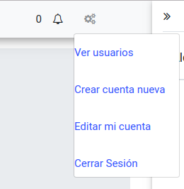

Al seleccionar la opción "Ver usuarios", será redirigido a una pantalla donde se enlistan lo usuarios actuales del sistema.

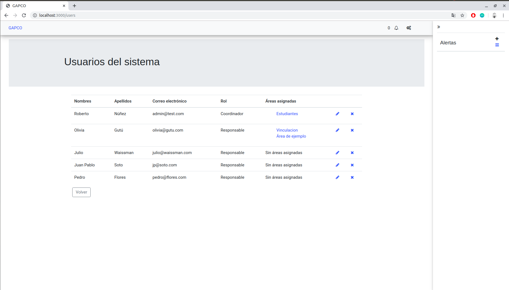

#### 2.3. Crear usuario
Dentro del sistema es posible crear nuevos usuarios los cuales tendran acceso a funcionalidades dentro del sistema de acuerdo al tipo de usuario que les haya sido asignado; para esto, el coordinador debe acceder al menú desplegable dentro del ícono superior derecho como se muestra:

Dentro de las opciones se muestra "Crear cuenta nueva"; al seleccionar esta opción, será redirigido al formulario donde se presentan los siguientes campos:

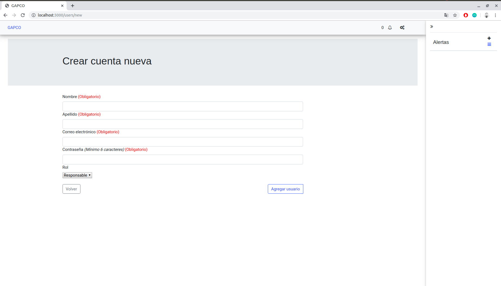

**Ojo:** Dentro de este formulario se encuentra la sección de Rol, donde se especifica qué privilegios tendrá el usuario creado.

Una vez llenada la información de los campos, es posible presionar el botón de "Agregar usuario", donde será redirigido a la página de información del nuevo usuario

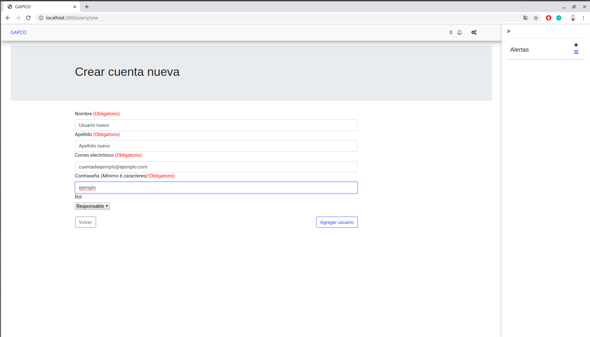

#### 2.4. Editar usuario
Para editar algún usuario exitente en el sistema, es necesario haber sido identificado como un coordinador. Una vez identificado como coordinador, es posible editar la información de un usuario al situarse sobre el listado de usuarios y seleccionando el ícono de "lápiz", se redirigirá a la pantalla de edición del usuario seleccionado:

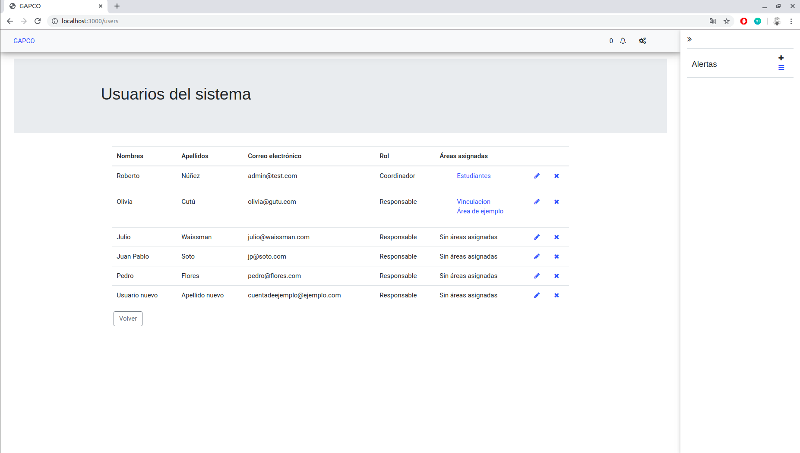

En este caso, seleccionaremos el usuario "Usuario nuevo", por lo que veremos la siguiente pantalla:

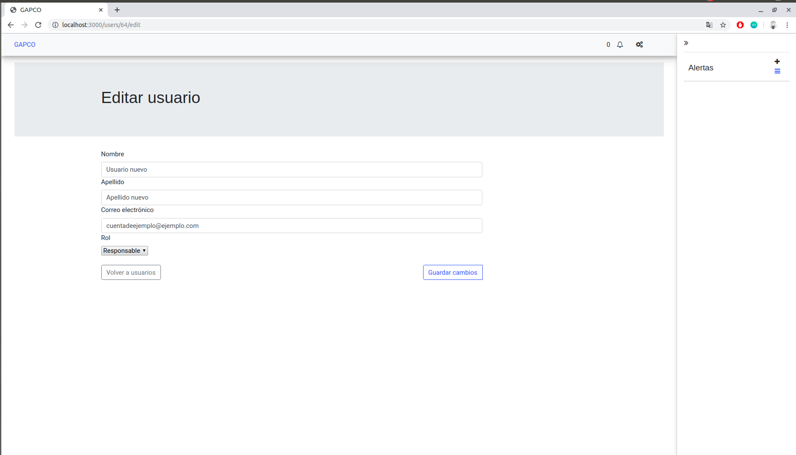

Al terminar de realizar los cambios, basta con pulsar "Guardar cambios", lo cual redirigirá a la pantalla de información del usuario con la información actualizada.

#### 2.5. Eliminar usuario
Para eliminar un usuario del sistema, es necesario haber sido identificado como un coordinador ante este mismo; una vez así, es posible acceder al listado de usuarios y seleccionar el ícono de "x", donde aparecerá un mensaje de confirmación:

Al aceptar, aparecerá el listado con la información actualizada.

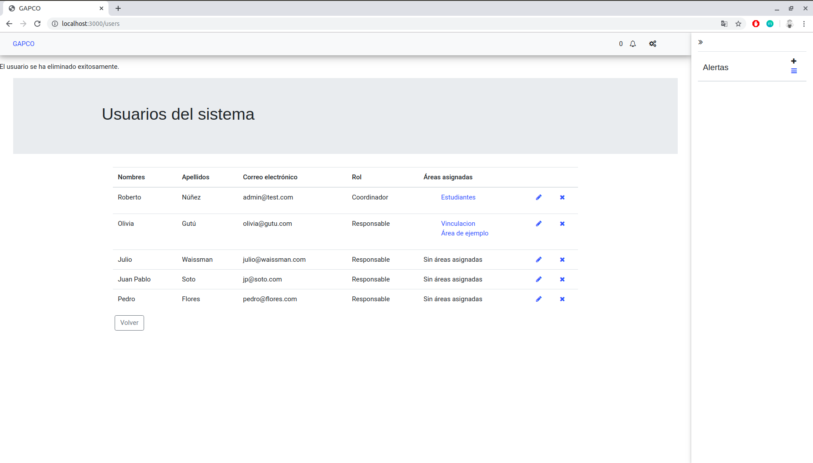

## 3. Cuenta
GAPCO cuenta con un sistema de manejo de usuarios, los cuales desempeñan distinto roles dentro de la aplicación; para esto, es necesario el manejo de sesiones. En la siguiente sección se enuncian las funciones necesarias para el uso de las cuentas dentro del sistema.

#### 3.1 Inicio de sesión
Para acceder a las funciones que proporcina el sistema, es necesario identificarse como un usuario de éste mismo; para esto, el usuario puede ingresar a la página www.gapco.uson.mx, donde la pantalla principal proporcionará un formulario con los siguientes campos:

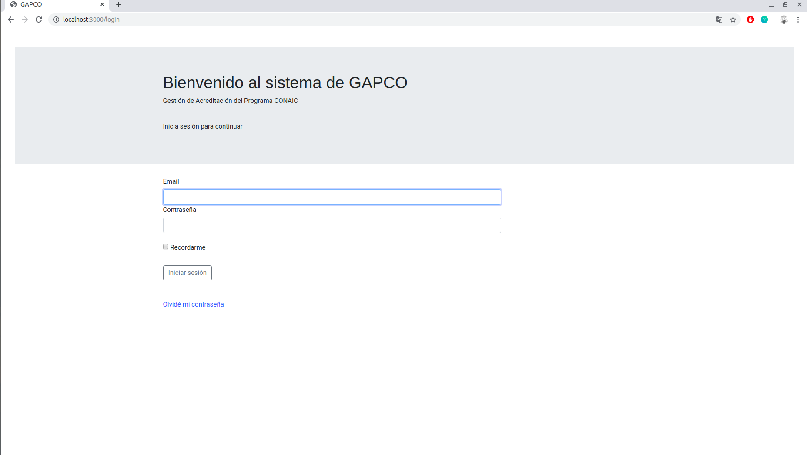

Una vez que se introducen los datos de la cuenta del usuario, se puede proceder a pulsar "Iniciar sesión"

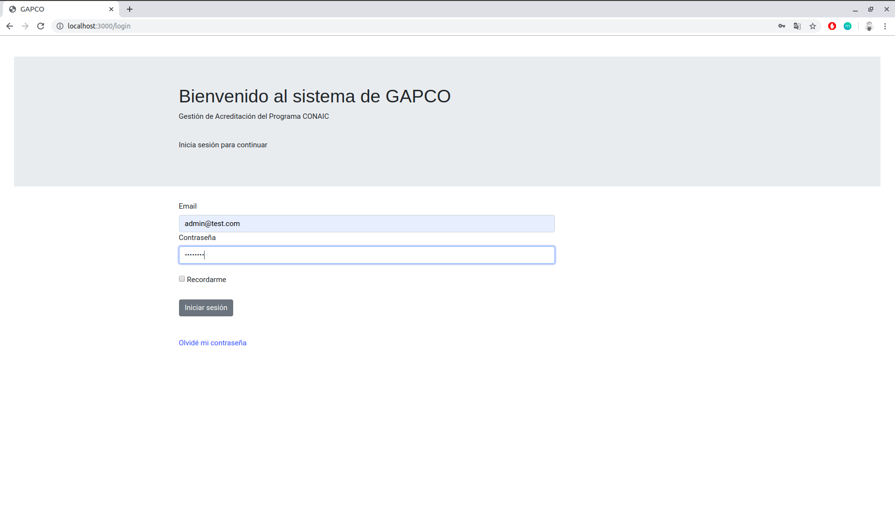

De esta forma, se abrá identificado ante el sistema como un usuario perteneciente a éste, mostrando las áreas que actualmente existen dentro de GAPCO, así como una noticia en la parte superior de inicio de sesión.

#### 3.2 Cerrar sesión
Una vez que se ha terminado de utilizar el sistema, es posible terminar la sesión del usuario; para esto, es necesario colocarse en la parte superior derecha de la pantalla, donde se encuentra el icono superior derecho. Al pulsar sobre él, se desplegará un menú donde aparecerán las siguientes opciones:

Para cerrar la sesión actual basta con pulsar sobre la opción "Cerrar sesión", donde se devolverá a la pantalla de inicio.

#### 3.3 Editar mi cuenta y cambiar mi contraseña
En dado caso que un usuario necesite cambiar la información de su cuenta, se proporciona un mecanismo para lograr esto. Para ello es necesario situarse en el ícono superior derecho, donde se despliega el menú con las siguientes opciones:

Para editar, seleccione la opción "Editar mi cuenta", donde se redirigirá a la pantalla de edición, donde aparecerán los datos actuales del usuario.

Para modificar cualquiera de los datos, basta con cambiar los valores que aparecen en el campo en específico. En caso de necesitar cambiar la contraseña de su cuenta, debe introducir la nueva contraseña deseada dentro del campo "Introduce una nueva contraseña (6 caracteres)", así como en su confirmación.

**Importante:** Para que los cambios sean aceptados, es necesario introducir la contraseña actual de su cuenta.

#### 3.4 Olvidé mi contraseña
En dado caso que el usuario haya olvidado la contraseña para ingresar a GAPCO, es posible recuperarla por medio de su correo electrónico que haya sido registrado en el sistema.

Para esto, es necesario encontrarse en la pantalla de inicio de sesión, donde en la parte inferior se encuentra "Olvidé mi contraseña".

Al pulsar sobre este hipervínculo, será redirigido a una nueva sección, donde se solicitará su correo electrónico; una vez aquí, se le proporcionarán las instrucciones de recuperación de su cuenta por medio de un correo a nombre de verificacionccuson@gmail.com.

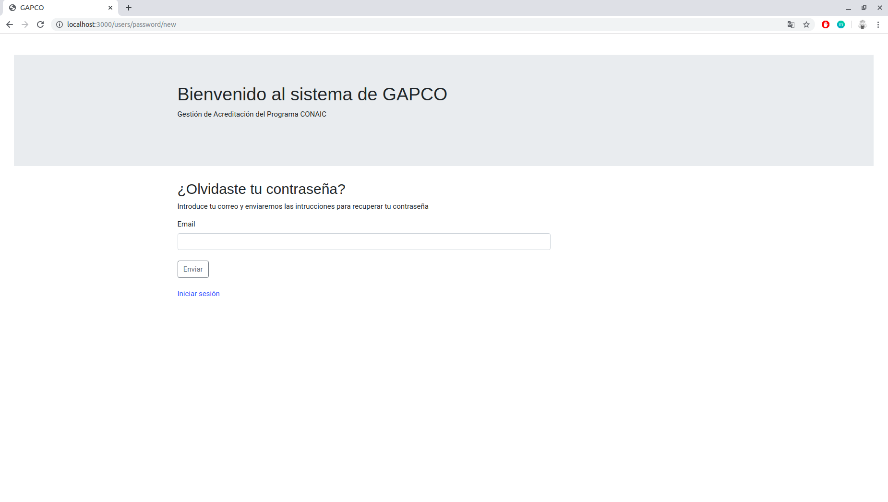

## 3. Áreas
Una parte importante dentro de la gestió de la información para la acreditación del programa es la separación de las categorías en áreas, las cuales cuentan con un nombre, descripción, una enumeración y un responsable.

Esta sección explica las distintas funciones correspondientes al manejo de estas áreas.

#### 3.1. Ver listado de áreas
Para ver el listado de áreas, basta con dar click sobre el nombre de GAPCO en la esquina superior izquierda, donde se redirigirá a la siguiente pantalla independientemente del lugar de procedencia:

#### 3.2. Ver área
Para ver la información de un área en particular estando en la página de lista de áreas, basta con pulsar sobre el nombre del área o sobre el ícono de "Ver".

Al pulsar alguna de estas dos opciones, se redirigirá a la página con la información específica del área seleccionada.

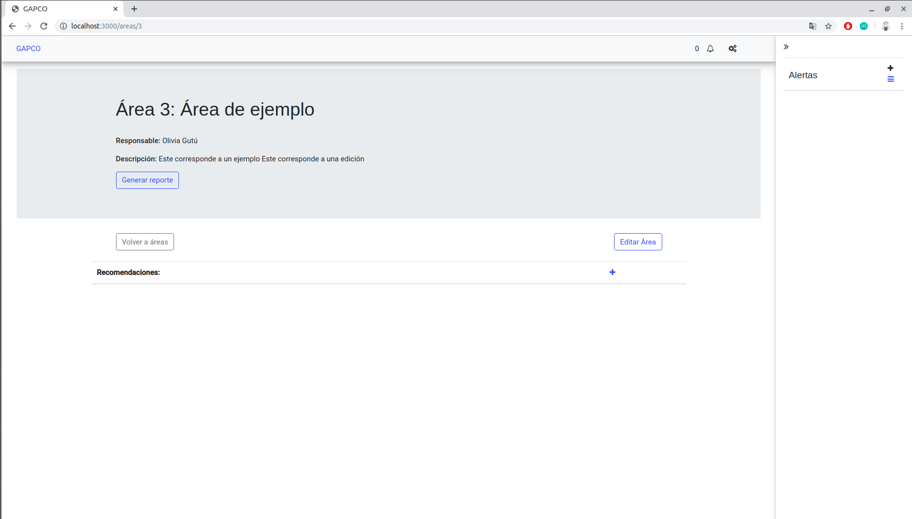
#### 3.3. Crear área nueva
Una función importante para el  manejo de áreas es la creación de estas mismas, función que únicamente puede ser accedida por el coordinador (ver sección de Usuarios); Para crear un área es necesario situarse en la pantalla de inicio, posterior a haber iniciado sesión ante el sistema.

Aquí se muestra una lista de las áreas existentes dentro de GAPCO; para crear un área nueva es necesario situarse en la parte superior derecha de la tabla de Categorías CONAIC para revisión y seguimiento, donde se muestra un ícono de "+". Al pulsar este ícono, será redirigido a una nueva pantalla, donde se muestra el siguiente formulario:

Es necesario llenar los campos correspondientes, para esto se presenta el siguiente ejemplo:

Al haber terminado con el llenado de la información, se puede proceder a guardar la nueva área por medio del botón inferior derecho, donde posteriormente será redirigido a la sección con la información del área recién creada.

#### 3.4. Editar área
Si se presenta la necesidad de editar la información de un área ya creada dentro del sistema se puede llevar a cabo la edición por medio de dos caminos: en la pantalla donde se muestran el listado de áreas al seleccionar el ícono de "lápiz" propio del área a editar o en la sección de información del área a editar en el botón "Editar área".

Una vez realizada alguna de estas dos opciones, se mostrará el siguiente menú de edición, donde se presentarán los datos actuales del área; para cambiarlos, basta con modificar los campos correspondientes:

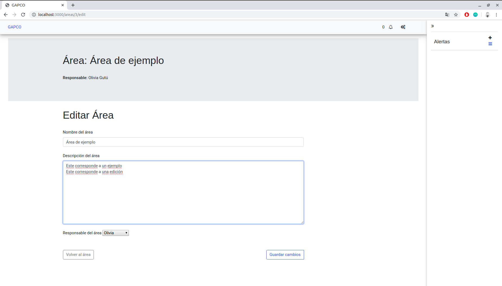

Una vez terminada la edición, se puede presionar el botón "Guardar cambios", donde se regresará a la página de información del área con su información actualizada.

#### 3.5. Eliminar área
Para eliminar un área existente, es necesario haber sido identificado como un coordinador ante el sistema; una vez hecho esto, es posible dirigirse al listado de áreas, donde aparecerá un ícono de "x" al final de cada área; al presionarlo, aparecerá un mensaje de confirmación de eliminación.

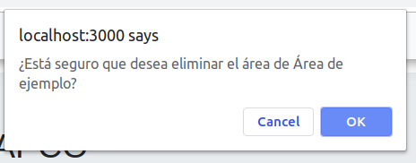

Al confirmar la eliminación del área, se mostrará el listado de áreas con la información actualizada.

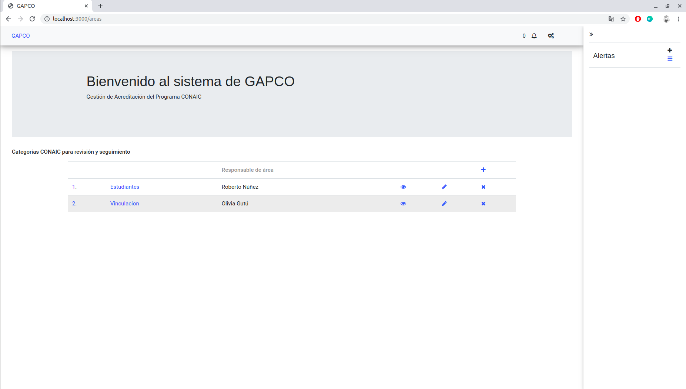

## 4. Recomendaciones
Dentro de cada área contenida en el sistema, podemos encontrar una serie de recomendaciones. Estas se manejan de forma individual dentro de cada área y son importantes para la gestión de evidencias; esta sección pretende explicar el manejo y gestión de las recomendaciones para facilitar su manipulación en el sistema.

#### 4.1. Ver recomendación
Para ver una recomendación es necesario haber accedido al área correspondiente a esta (ver sección "Ver área"). Al estar en la sección del área, es posible encontrar el listado de recomendaciones de esta misma:

Para poder ver el contenido de la recomendación, basta con dar click sobre su nombre o bien sobre el ícono de "Ver" así será dirigido hacia la pantalla de información de la recomendación.

#### 4.2. Crear recomendación
Para crear una recomendación es necesario ser identificado como coordinador o ser el responsable del área en cuestión. Al cubrir alguno de estos requerimientos, es posible generar una nueva recomendación; para esto, basta con dar click en el ícono "+" que aparece en la esquina superior derecha de la tabla de recomendación del área:

Al realizar esto, será redigido al formulario de creación de recomendación, donde se solicitará la información de la recomendación a crear; en este ejemplo crearemos una nueva recomendación llamada "recomendación de ejemplo"

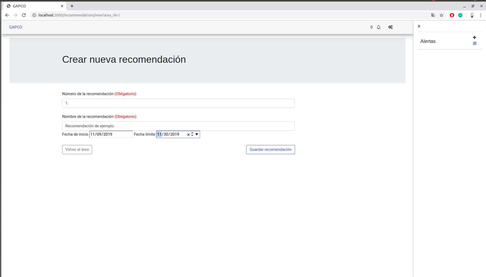

Al llenar los campos, seleccionamos "Guardar recomendación", donde seremos redirigidos a la página de información de esta nueva recomendación.

#### 4.3. Editar recomendación
Si se presenta el caso donde sea necesario editar una recomendación ya existente, podemos ir a la página de información de la recomendación o seleccionar el ícono de "Editar" en la sección de su área correspondiente. Vea que es necesario ser responsable del área en cuestión o bien ser el coordinador.

De ambas formas, será redirigido hacia la sección de edición, donde aparecerá la información actual de la recomendación; para cambiarla basta con editar los campos correspondientes.

Al terminar la edición, podemos guardar los cambios, donde se mostrará la sección del área con la información actualizada de la recomendación.

#### 4.4. Eliminar recomendación
Para eliminar una recomendación es necesario se responsable del área correspondiente o bien ser identificado como coordinador; de cualquier forma, es posible eliminar una recomendación dando click sobre el ícono "x" de la recomendación en el listado de recomendaciones.

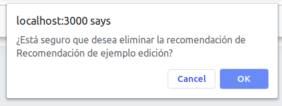

Una vez hecho esto, se mostrará un mensaje de confirmación; al aceptar la eliminación, la recomendación correspondiente habrá sido eliminada.

## 5. Metas y acciones
Dentro de cada recomendación podemos encontrar metas y acciones propias de ella; estas son presentadas en el reporte, por lo que se muestra información sobre su gestión en los siguientes apartados.

#### 5.1. Crear meta y acción
Para crear una meta y acción (también pueden crearse varias acciones por meta) es necesario ser responsable del área a la que pertenece la recomendación de las metas y acciones a agregar, o bien, se identificado como el coordinador. Al cumplir alguno de estos requisitos, podemos agregar una meta y acción.

Para esto, debemos situarnos en la página de información de la recomendación en cuestión y seleccionar el ícono "+" que se encuentra al lado de "Metas"

Al realizar esto, se desplegará la siguiente ventana:

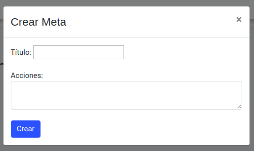

**Ojo:** Para agregar más de una acción a esta recomendación, separa las acciones por saltos de línea.

Aquí podemos llenar la información necesaria; se muestra el siguiente ejemplo:

Al finalizar, podemos seleccionar "Crear", lo cual permitirá que podamos visualizar la nueva meta con sus respectivas acciones.

#### 5.2. Editar meta y acción
Para editar una meta o acción ya existentes, podemos situarnos en la página de la recomendación a la que pertenecen y dar click sobre el ícono "lápiz", donde se desplegará la ventana de edición. A continuación se muestra un ejemplo:

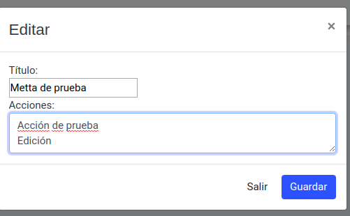

Al guardar la información, se habrá actualizado la meta y acción (o acciones) que hayamos editado.

#### 5.3. Eliminar meta y acción
Finalmente, para eliminar una meta (y sus respectivas acciones), podemos situarnos en la página de su respectiva recomendación y seleccionar el ícono de "x" que está al lado del nombre de la meta; al dar click sobre este ícono, se eliminará la meta con todo su contenido.

## 6. Evidencias
El motivo de GAPCO es gestionar las evidencias que se proporcionan a CONAIC, por lo que la gestión de éstas es de suma importancia para este sistema, así que esta sección trata sobre las funciones que se relacionan directamente con estas evidencias.

#### 6.1. Ver evidencia
Para poder visualizar el contenido de una evidencia, podemos acceder a ella situandonos en la página de información de la recomendación a la que esta pertenece y dando click sobre sobre el ícono "Ver"; de esta forma, se nos mostrará la sección con la información de esta evidencia:

#### 6.2. Crear evidencia
Para crear una evidencia dentro de GAPCO es necesario ser el responsable del área de la recomendación a la que esta pertenecerá o bien ser identificado como coordinador ante el sistema; al cumplir alguno de los requisitos, es posible crear una evidencia nueva dando click sobre el ícono de "+" que se encuentra en la esquina superior derecha de la tabla de listado de evidencias en la página de la recomendación a la que esta pertenece.

Al dar click, aparecerá el formulario, donde podemos llenar la información correspondiente así como los archivos que corresponden a la evidencia a generar. Al terminar que documentar la información podemos guardar la evidencia, donde seremos redireccionados a la página de información de la evidencia. Aquí podemos ver un ejemplo del funcionamiento:

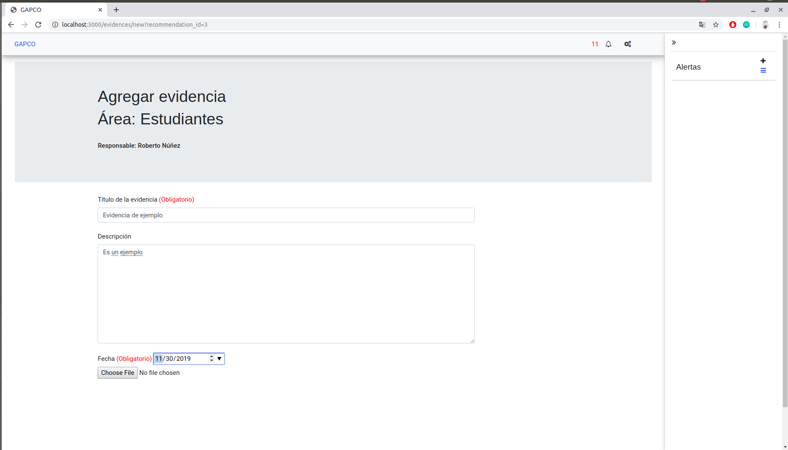

#### 6.3. Editar evidencia
En dado caso que sea necesario editar una evidencia ya existente, podemos seleccionar "Editar" (ícono de lápiz) que se encuentre al lado de esta evidencia en el listado de todas las de la recomendación; note que es necesario ser el responsable del área de la recomendación en cuestión o bien ser identificado como coordinador.

Así bien, podemos ver el formulario de edición, donde podemos guardar la información nuevo necesaria.

Y finalmente, guardar los cambios para ver la información actualizada en el listado de evidencias.

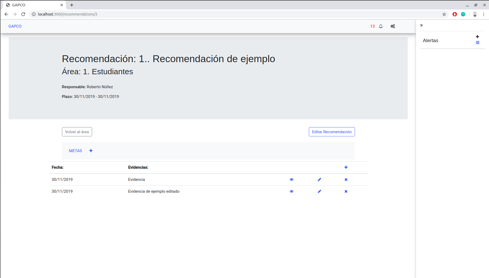

#### 6.4. Eliminar evidencia
Con el fin de eliminar una evidencia, el usuario deberá ser el responsable del área de la recomendación donde se encuentre la evidencia a eliminar, o bien ser el coordinador dentro del sistema; así bien, se puede seleccionar el ícono "x" que se encuentre el lado de la evidencia en cuestión en el listado de evidencias, donde aparecerá el mensaje de confirmación:

Al confirmar la eliminación, se mostrará el listado de evidencias actualizado.

## 7. Alertas
GAPCO cuenta con un sistema de alertas, las cuales cuentan con un mensaje así como un plazo donde estas se encuentras vigentes. Esta sección explica el funcionamiento de estas alertas para su uso. Note que las alertas dejan de ser visibles una vez que se vence su plazo de validez.

#### 7.1. Ver alertas
Para ver todas las alertas así como el estados de estas, es solo necesario presionar el ícono de "Menú" en la sección de alertas (debajo del signo de "+"); esto dirigirá al usuario a la pantalla de alertas:

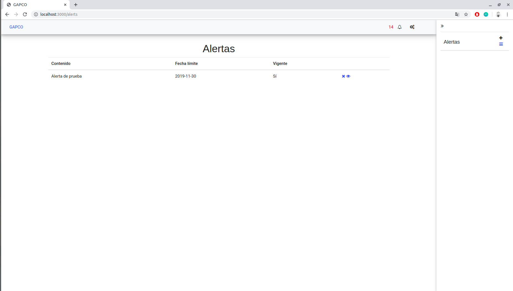

#### 7.2. Crear alerta
Para crear una alerta, es necesario que el usuario sea identificado como el coordinador; una vez cubierto este requisito, el usuario puede dirigirse a la barra de alertas que se encuentra a la derecha de la pantalla, donde en la parte superior se muestra el ícono "+" y se mostrará el siguiente formulario:

Al llenar los campos, podemos continuar y crear la alerta.

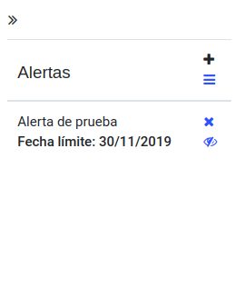

A partir de ese momento la alerta será visible para todos los usuarios hasta el día de su vencimiento, su eliminación o hasta que sea oculta.

#### 7.3. Eliminar alerta
Para que una alerta ya no exista dentro de GAPCO, es necesario ser identificado como coordinador. de esta forma, es necesario situarse sobre la alerta que queremos eliminar y dar click sobre su ícono "x"; esto desplegará la ventana de confirmación:

Al aceptar la confirmación la alerta ya no estará disponible para ningún usuario.

#### 7.4. Ocultar alerta
Si bien un usuario con rol de responsable no puede eliminar una alerta, si es posible ocultarla. Para esto basta con dar click sobre el ícono "Ocultar", que haŕa que la alerta no se muestre más al usuario hasta que este mismo lo desee (ver sección "Mostrar alerta").

#### 7.5. Mostrar alerta
Para mostrar una alertas que se había ocultado, es necesario ir a la sección de todas las alertas y dar click sobre el ícono "Mostrar" de la alerta en cuestión.

## 8. Notificaciones
Dentro de GAPCO existe un sistema de notificaciones de actividad de los demás usuarios, los cuales informan al coordinador sobre actividad de todos los usuarios, o bien, informan al usuario sobre actividad en su área asignada. Dentro de cada pantalla se muestra el número de notificaciones sin haber leído en la parte superior derecha, al lado del ícono de notificación.

A continuación se habla sobre el funcionamiento de las notificiaciones.
#### 8.1. Ver notificaciones
Es posible ver el historial de actividad de distintos usuarios dentro del sistema, para ello basta con dar click sobre el ícono de notificaciones en la esquina superior derecha, donde se desplegará el siguiente menú:

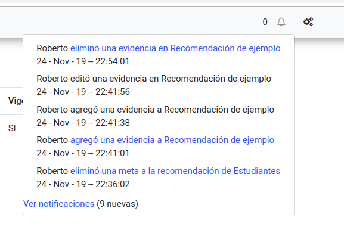

Al dar click sobre "Ver notificaciones" se nos presentará un listado de la actividad reciente en GAPCO del área del usuario o de todos los usuarios en caso del coordinador.

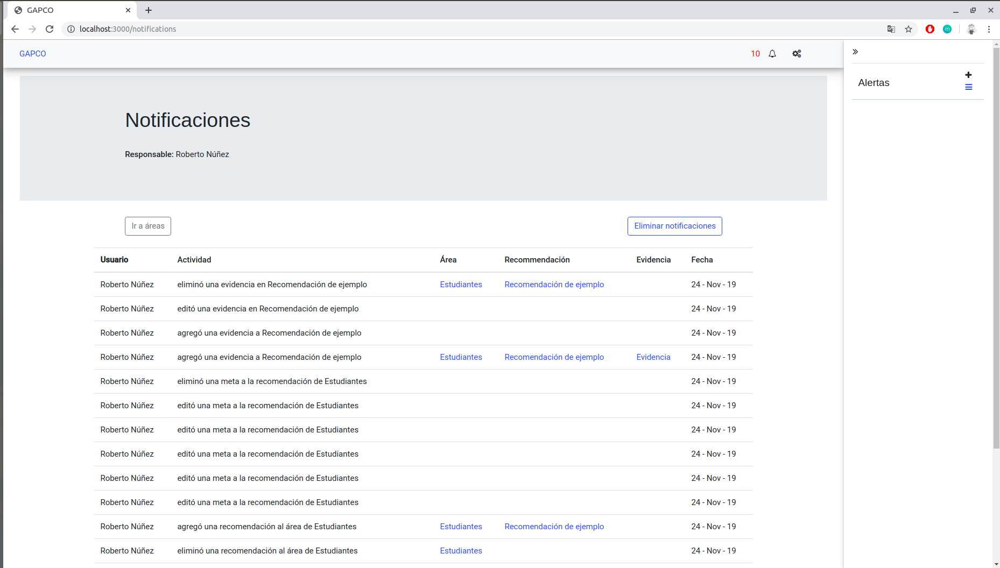

#### 8.2. Eliminar notificaciones
De ser necesario, existe la opción de borrar todas las notificaciones, para ello es necesario situarse en la página de listado de notificaciones.

Una vez aquí basta con dar click sobre "Borrar notificaciones", lo que vaciará el historial de actividiad.

## 9. Reportes
Una parte crítica de GAPCO es la generación de reportes con la información que existe dentro del sistema, por lo que se procede a mostrar como generar un reporte para descarga de un área en específico.

#### 9.1. Generar reporte
Para generar un reporte, es necesario seleccionar el área de la cuál queremos información, una vez aquí podemos seleccionar el botón "Generar reporte", el cuál desplegará la siguiente ventana para especificar el periodo de tiempo a considerar:

Al seleccionar "Crear", se comenzará a generar un reporte del área seleccionada con las evidencias del periodo especificado.

